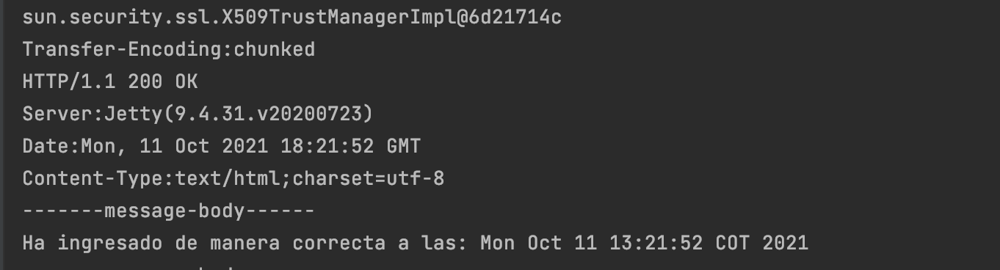
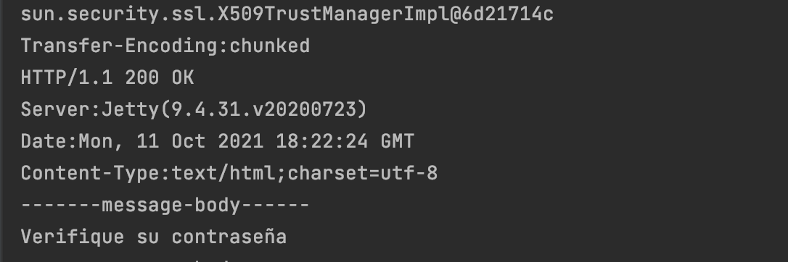

# seguridad

Se realiza un prototipo de aplicación web en donde se busca tener seguridad en todos los frentes. Es decir, autenticación, autorización e integridad de usuarios.
Para desarrollar este laboratorio se procedio de la siguiente manera:

Se crea la clase **HelloService** la cual tiene expuesto un servicio REST. Sin embargo para lograr tener seguridad se procede a realizar el par de llaves publicas 
y privadas y un certificado. La llave publica se utilizara para cifrar la información, la privada se utiliza para descifrar la información.

Después de esto se procede a realizar un login para poder realizar la autenticación adecuada, a la contraseña correspondiente se le obtiene el hash para luego 
compararlo con el que el usuario nos va a brindar, de esta manera si el usuario envio la contraseña correcta aparecera el siguiente mensaje 


Si ingresa la contraseña incorrecta aparecera este mensaje 


los datos por ahora son enviados en el request de la siguiente manera

```
https://localhost:4567/login?user=sadf&password=helloworld
```

Al momento de comunicarnos desde otro servidor aparecere de la siguiente manera en caso de que la contraseña sea la correcta 



en caso de que sea incorrecta se genera el siguiente mensaje 




